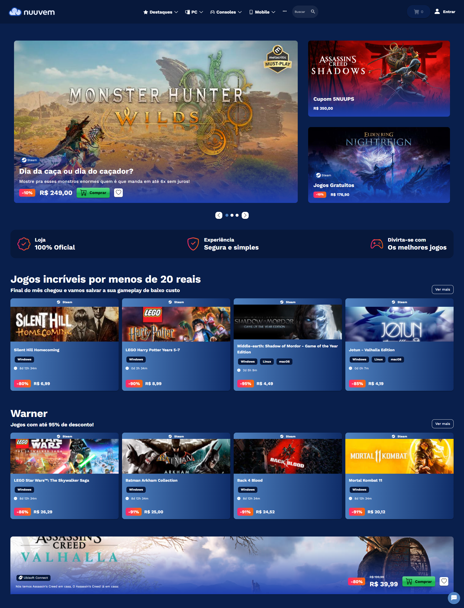

# Projeto: Remake de site/app web

Acesso: [Nuuvem Remake](https://nuuvem-remake.netlify.app)

#### Desenvolvedor(a)

Murilo Leal - Ciência da Computação

#### Cliente

Mártin Renz

#### Site/app original

##### Link

[Nuuvem](https://nuuvem.com)

##### Descrição

Site com com tonalidade principal azul, tema dark, cards arredondados e estrutura bem repetitiva, com grid de 4 cards seguidas de banners maiores.

#### Demanda do(a) cliente

O remake deve ter o design mais similar possível ao site original.
O remake deve ser responsivo.
Deve conter a página inicial da Nuuvem, apresentando os principais jogos a venda, em promoção, etc..
Deve ser possível pesquisar por jogos.
Deve ser possível adicionar jogos no carrinho.
Deve ser possível acessar a tela de login, porém a função de login não é necessária ser desenvolvida.
Deve ser possível selecionar o botão superior a esquerda do site, que lista opções de jogos como Nintendo, Xbox, etc.. mas não é necessário desenvolver a página em si.
Não é necessário desenvolver o assistente virtual que existe no site da Nuuvem.
Outras rotinas como suporte, termos de uso, etc.. não são necessárias o desenvolvimento das páginas.

#### Desenvolvimento

Desenvolvimento feito com Vue.js 3, Quasar Framework para componentes, temas, tradução e funcionalidades nativas, além de TailwindCSS para estilizações.

#### Tecnologias

- Vue.js 3 - Framework principal
- Quasar Framework - Setup de projeto, biblioteca completa de componentes, triggers, utils, temas, tradução
- TailwindCSS para estilizações inline
- Pinia para controle e gerenciamento de estado
- i18n para traduções
- ESLint e Prettier para identação e controle de warnings

#### Ambiente de desenvolvimento

- VSCode para implementação
- Netlify para deploy

#### Referências e créditos

- [Demais projetos feitos por mim](https://github.com/muriloleal13?tab=repositories)
- [Quasar Framework](https://quasar.dev)
- [TailwindCSS](https://tailwindcss.com)
- [BootStrap Icons](https://icons.getbootstrap.com)
- [Material Symbols](https://fonts.google.com/icons)

---

Projeto entregue para a disciplina de [Desenvolvimento de Software para a Web](http://github.com/andreainfufsm/elc1090-2025a) em 2025a
